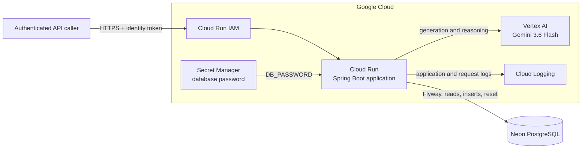

# Synthetic Data Agent

An AI agent that generates relational test data, follows configurable business rules and distributions, validates constraints, and automatically seeds PostgreSQL.

Synthetic Data Agent turns a compact dataset specification into a connected, internally consistent test dataset. Instead of hand-writing fixtures table by table, a caller describes the desired volume and rules; the agent coordinates generation across related entities, writes the results to PostgreSQL, and reports how the generated data satisfies the requested constraints.

> **Hosted demo access:** The deployed Cloud Run service is protected with Google Cloud IAM and is not available for anonymous invocation. To run the project, use your own Google Cloud project and database credentials following the instructions below.

## Why this project exists

Realistic relational test data is tedious to create. Useful datasets need more than plausible-looking rows: they must preserve foreign keys, valid enum values, cross-field business rules, requested distributions, calculated values, and relationships between records.

Synthetic Data Agent uses Gemini through Vertex AI to orchestrate that work while retaining deterministic checks for the rules that must not be left to intuition.

## What it does

- Generates connected data for a relational sales-style domain.
- Seeds regions, managers, representatives, product categories, products, customers, orders, and order lines.
- Respects configured record counts, distributions, and domain constraints.
- Preserves referential integrity across the generated dataset.
- Validates rules such as customer status/verification combinations.
- Verifies calculated order-line amounts against product price and quantity.
- Controls the percentage of orders containing a single order line.
- Returns a concise generation and compliance summary.
- Provides a reset operation that removes generated business data while retaining Flyway history and distribution/configuration data.

## Example rules

The agent is designed to handle rules that span more than one field or table, including:

- unverified customers must be inactive;
- only customers with `NEW` status may be unverified;
- inactive customers may be distributed across allowed statuses;
- order statuses must follow requested proportions;
- `orderline.amount = product.price × quantity`;
- only an allowed percentage of orders may contain a single order line;
- generated foreign keys must reference existing records.

## Architecture



Request flow:

```text
authenticated caller
    -> Cloud Run IAM
    -> Spring Boot agent
    -> Gemini on Vertex AI
    -> Neon PostgreSQL
    -> persisted, validated relational dataset
```

IAM is the service boundary rather than a step inside the application workflow: Google Cloud authenticates and authorizes the caller before the request reaches Spring Boot.

## Built with

| Layer | Technology |
|---|---|
| Language | Java 21 |
| Application | Spring Boot 4.1.0 |
| Agent framework | Google ADK 1.7.1 |
| Model SDK | Google Gen AI SDK 1.65.0 |
| Model | Gemini 3.6 Flash through Vertex AI |
| Persistence | PostgreSQL, Spring Data JPA |
| Managed database | Neon PostgreSQL |
| Schema migrations | Flyway |
| Cloud runtime | Google Cloud Run |
| Secret storage | Google Secret Manager |
| Access control | Cloud Run IAM |
| Build | Maven |
| Verification | JUnit and Testcontainers |
| Runtime health | Spring Boot Actuator and Cloud Logging |

## API

### Generate and seed data

```http
POST /agent/seed-all-tables
Content-Type: application/json
```

The request describes the dataset to generate. The repository includes `json_test.json` as a small reproducible request example.

Local invocation:

```bash
curl --fail-with-body \
  -H 'Content-Type: application/json' \
  --data @json_test.json \
  http://localhost:8080/agent/seed-all-tables
```

### Reset generated data

```http
GET /admin/reset-database
```

This operation clears the generated business tables and resets their sequences while preserving Flyway history and distribution/configuration data.

```bash
curl --fail-with-body http://localhost:8080/admin/reset-database
```

> The reset endpoint is destructive. Do not expose this application anonymously or point it at a database containing data you need to preserve.

## Prerequisites

- Java 21
- Maven, or the included Maven wrapper
- PostgreSQL or a Neon PostgreSQL project
- A Google Cloud project with billing enabled
- Vertex AI access in that project
- Google Application Default Credentials for local execution
- The Google Cloud CLI for cloud deployment

## Configuration

The application reads four required runtime variables:

| Variable | Purpose | Secret? |
|---|---|---|
| `DB_URL` | PostgreSQL JDBC URL | No, although it contains infrastructure details |
| `DB_USER` | PostgreSQL role/user | Treat as sensitive configuration |
| `DB_PASSWORD` | PostgreSQL password | **Yes** |
| `GOOGLE_CLOUD_PROJECT` | Project used for Vertex AI/Gemini | No |

Use a JDBC URL without embedded credentials:

```text
jdbc:postgresql://<POSTGRES_HOST>/<DATABASE_NAME>?sslmode=require&channel_binding=require
```

Do not convert a URI containing `user:password@host` by simply adding `jdbc:`. PostgreSQL JDBC expects the username and password separately in this setup.

Never commit real values in `application.yaml`, `.env`, shell scripts, screenshots, or documentation.

## Run locally

### 1. Clone the repository

```bash
git clone https://github.com/malet-pr/syntheticDataAgent.git
cd syntheticDataAgent
```

### 2. Create the database

Create a PostgreSQL database—for example, `synthetic_data`—or create a Neon project and database. Copy its hostname, database name, role, and password.

For Neon, require TLS in the JDBC URL:

```text
jdbc:postgresql://<NEON_HOSTNAME>/synthetic_data?sslmode=require&channel_binding=require
```

### 3. Authenticate to Google Cloud

Enable Vertex AI in your Google Cloud project, then create local Application Default Credentials:

```bash
gcloud auth application-default login
gcloud config set project '<GCP_PROJECT_ID>'
```

Your identity must be allowed to use Vertex AI in that project.

### 4. Export runtime configuration

```bash
export DB_URL='jdbc:postgresql://<POSTGRES_HOST>/synthetic_data?sslmode=require&channel_binding=require'
export DB_USER='<POSTGRES_USER>'
export DB_PASSWORD='<POSTGRES_PASSWORD>'
export GOOGLE_CLOUD_PROJECT='<GCP_PROJECT_ID>'
```

For a local PostgreSQL instance without TLS, use the JDBC parameters appropriate for that instance instead of copying the Neon URL verbatim.

### 5. Start the application

```bash
./mvnw spring-boot:run
```

Flyway applies the schema migrations and initializes the required configuration data during startup. Hibernate validates the resulting schema rather than creating it.

### 6. Run a smoke test

Start with the small request included in the repository:

```bash
curl --fail-with-body \
  -H 'Content-Type: application/json' \
  --data @json_test.json \
  http://localhost:8080/agent/seed-all-tables
```

Confirm that the generated rows appear in PostgreSQL, then return the database to its baseline state if needed:

```bash
curl --fail-with-body http://localhost:8080/admin/reset-database
```

## Run the tests

```bash
./mvnw test
```

The project uses JUnit and Testcontainers so integration and agent-level checks can run against an isolated PostgreSQL instance rather than the configured Neon database. Flyway builds the test schema through the same migration path used by the application.

The deterministic evaluation approach is:

```text
start isolated PostgreSQL
    -> apply Flyway migrations
    -> run the agent
    -> query the generated dataset
    -> assert business and distribution invariants
```

Checks focus on outcomes such as valid amounts, status distributions, customer rules, record counts, and relational integrity. Model output can vary; hard business invariants should not.

Docker must be available for Testcontainers-based tests.

## Deploy to Google Cloud Run

The following procedure deploys the source through Cloud Build, injects the Neon password from Secret Manager, grants the runtime identity access to Vertex AI, and keeps invocation private.

### 1. Set deployment variables

```bash
export APP_GCP_PROJECT='<GCP_PROJECT_ID>'
export APP_VERTEX_PROJECT='<VERTEX_AI_PROJECT_ID>'
export APP_GCP_REGION='<GCP_REGION>'
export APP_SERVICE='synthetic-data-agent'
export APP_SECRET='neon-db-password'
export APP_DB_HOST='<NEON_HOSTNAME>'
export APP_DB_NAME='synthetic_data'
export APP_DB_USER='<NEON_DATABASE_USER>'

gcloud config set project "$APP_GCP_PROJECT"
gcloud config set run/region "$APP_GCP_REGION"
```

If Cloud Run and Vertex AI use the same project:

```bash
export APP_VERTEX_PROJECT="$APP_GCP_PROJECT"
```

### 2. Enable the required APIs

```bash
gcloud services enable \
  run.googleapis.com \
  cloudbuild.googleapis.com \
  artifactregistry.googleapis.com \
  secretmanager.googleapis.com \
  aiplatform.googleapis.com
```

### 3. Create the database-password secret

```bash
gcloud secrets create "$APP_SECRET" \
  --replication-policy='automatic'

read -rsp 'Neon database password: ' APP_NEON_PASSWORD
printf '%s' "$APP_NEON_PASSWORD" | \
  gcloud secrets versions add "$APP_SECRET" --data-file=-
unset APP_NEON_PASSWORD
```

Pin deployments to a numeric secret version rather than `latest`. When rotating the database password, create a new secret version and deploy a new Cloud Run revision referencing that version.

### 4. Authorize the runtime service account

Cloud Run calls Secret Manager and Vertex AI as its runtime service account—not as the person running the deployment command.

The established setup used the default compute service account:

```bash
APP_PROJECT_NUMBER="$(gcloud projects describe "$APP_GCP_PROJECT" --format='value(projectNumber)')"
APP_RUNTIME_SA="${APP_PROJECT_NUMBER}-compute@developer.gserviceaccount.com"
```

For a longer-lived environment, prefer a dedicated least-privilege service account and supply it during deployment with `--service-account`.

Grant access only to the database-password secret:

```bash
gcloud secrets add-iam-policy-binding "$APP_SECRET" \
  --member="serviceAccount:${APP_RUNTIME_SA}" \
  --role='roles/secretmanager.secretAccessor'
```

Grant permission to use Vertex AI:

```bash
gcloud projects add-iam-policy-binding "$APP_VERTEX_PROJECT" \
  --member="serviceAccount:${APP_RUNTIME_SA}" \
  --role='roles/aiplatform.user'
```

### 5. Review `.gcloudignore`

`gcloud run deploy --source .` packages every file not excluded from the source upload. At minimum, exclude credentials and local/build artifacts:

```gitignore
.git
.idea
.vscode/

target/
src/test/

*.log
*.iws
*.iml
*.ipr

.env
.env.*
```

Do not exclude anything required by the Maven/buildpack build. In particular, retain the Maven wrapper JAR if the build depends on `./mvnw`.

### 6. Deploy

```bash
APP_DB_URL="jdbc:postgresql://${APP_DB_HOST}/${APP_DB_NAME}?sslmode=require&channel_binding=require"

gcloud run deploy "$APP_SERVICE" \
  --source . \
  --project "$APP_GCP_PROJECT" \
  --region "$APP_GCP_REGION" \
  --set-env-vars "DB_URL=${APP_DB_URL},DB_USER=${APP_DB_USER},GOOGLE_CLOUD_PROJECT=${APP_VERTEX_PROJECT}" \
  --set-secrets "DB_PASSWORD=${APP_SECRET}:<SECRET_VERSION>" \
  --no-allow-unauthenticated
```

If using a dedicated runtime service account, add:

```text
--service-account "${APP_RUNTIME_SA}"
```

Cloud Run supplies the listening port through `PORT`; Spring Boot must use that platform value rather than a conflicting hard-coded port.

### 7. Test the protected service

Obtain the deployed URL and an identity token:

```bash
APP_SERVICE_URL="$(gcloud run services describe "$APP_SERVICE" \
  --project "$APP_GCP_PROJECT" \
  --region "$APP_GCP_REGION" \
  --format='value(status.url)')"

APP_ID_TOKEN="$(gcloud auth print-identity-token)"
```

Run the reset smoke test:

```bash
curl --fail-with-body \
  -H "Authorization: Bearer ${APP_ID_TOKEN}" \
  "${APP_SERVICE_URL}/admin/reset-database"
```

Run the agent:

```bash
curl --fail-with-body \
  -H "Authorization: Bearer ${APP_ID_TOKEN}" \
  -H 'Content-Type: application/json' \
  --data @json_test.json \
  "${APP_SERVICE_URL}/agent/seed-all-tables"
```

An anonymous call should return `403 Forbidden`. A successful authenticated generation proves the complete cloud path:

```text
caller -> Cloud Run -> Spring Boot -> Gemini -> Neon -> persisted rows
```

## Security notes

- The hosted demo remains IAM-protected.
- The database password is stored in Secret Manager and injected into Cloud Run.
- The Cloud Run runtime identity receives only the roles required to read the secret and use Vertex AI.
- Source deployment artifacts are governed by Google Cloud project IAM; a reachable service URL does not make the source bundle public.
- `.gcloudignore` prevents credentials, test sources, IDE files, logs, and build output from entering the source bundle unnecessarily.
- The reset endpoint is operationally destructive and should never be exposed anonymously.
- Cloud IAM protects service invocation; application-level authorization would still be required for per-user or per-record permissions in a multi-user product.

## Troubleshooting

### Spring cannot resolve `GOOGLE_CLOUD_PROJECT`

The deployment variable must use the exact name expected by the application. Supplying `GCP_PROJECT_ID` does not satisfy `${GOOGLE_CLOUD_PROJECT}`.

### Cloud Run cannot access the database secret

Grant `roles/secretmanager.secretAccessor` to the actual Cloud Run runtime service account on the secret. Your personal permissions do not transfer to the container.

### Agent request fails with `aiplatform.endpoints.predict` denied

Grant `roles/aiplatform.user` to the Cloud Run runtime identity on the project used by Vertex AI. If Cloud Run and Vertex AI are in different projects, the binding belongs on the Vertex AI project. Allow a short period for IAM propagation and retry; a role-only correction normally does not require a redeploy.

### Reset succeeds, but generation fails

This confirms that Cloud Run, Spring Boot, Neon connectivity, and database authentication work. Inspect Vertex AI model access and the runtime identity next.

### PostgreSQL driver rejects the Neon JDBC URL

Do not include `user:password@host` in this JDBC URL. Use:

```text
jdbc:postgresql://<HOST>/<DATABASE>?sslmode=require&channel_binding=require
```

and provide `DB_USER` and `DB_PASSWORD` separately.

### Inspect Cloud Run logs

```bash
gcloud run services logs read "$APP_SERVICE" \
  --project "$APP_GCP_PROJECT" \
  --region "$APP_GCP_REGION" \
  --limit=300
```

## Current scope and limitations

- The project targets the included relational domain rather than arbitrary database schemas.
- The quality of natural-language fields can vary between model runs.
- Deterministic rules and distributions are the primary quality target; perfect human-like naturalness is future work.
- The deployed service uses platform-level IAM protection and is not a public multi-user application.
- The reset endpoint assumes a disposable test-data database.

## What is next

- Improve the naturalness and diversity of generated values while retaining strict rule compliance.
- Add deterministic planning and shuffling tools for constrained distributions instead of relying only on prompting.
- Expand agent evaluations across every configured distribution, enum, row count, and foreign-key invariant.
- Add repeated-run evaluation to measure consistency and identify model regressions.
- Introduce application-level authorization if the service evolves into a multi-user product.

## Project status

This is a working prototype deployed as a serverless Cloud Run service. The verified end-to-end path is:

```text
HTTPS request
    -> IAM-protected Cloud Run revision
    -> Spring Boot agent
    -> Gemini 3.6 Flash through Vertex AI
    -> Neon PostgreSQL
    -> generated relational data and compliance summary
```

